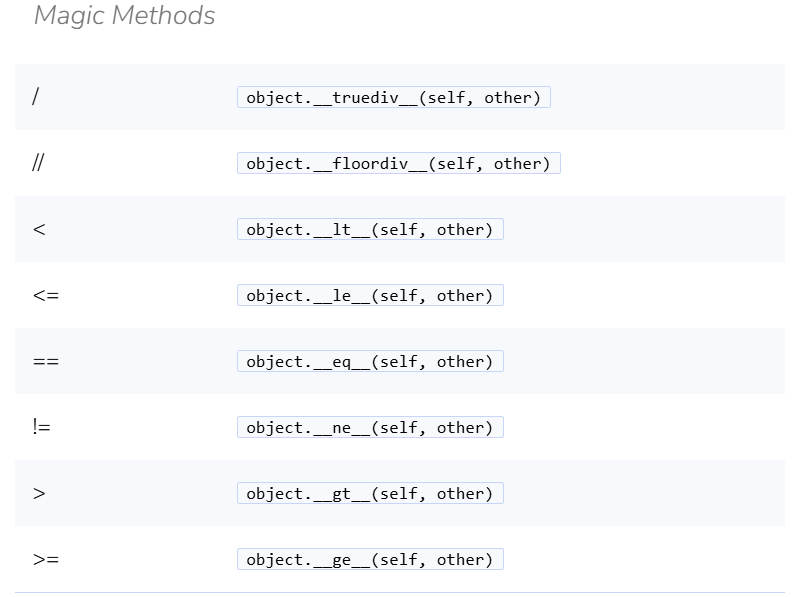

# Polymorphism

- Polymorphism is a fundamental concept in object-oriented programming that allows objects of different classes to be treated as objects of a common superclass. It enables a single interface to represent different underlying forms (data types). The main types of polymorphism are:
- 1. **Compile-time Polymorphism (Method Overloading)**: This occurs when multiple methods in the same class have the same name but different parameters. The method to be called is determined at compile time based on the method signature.
- 2. **Runtime Polymorphism (Method Overriding)**: This occurs when a subclass provides a specific implementation of a method that is already defined in its superclass. The method to be called is determined at runtime based on the actual object type, not the reference type.
- Polymorphism promotes code reusability and flexibility, allowing developers to write more generic and maintainable code. It is a key feature that enables the use of interfaces and abstract classes in object-oriented programming.

## Dunder Methods
